# Teeny Tiny Compiler

This is a compiler for a dialect of [BASIC](https://en.wikipedia.org/wiki/BASIC) called `Teeny Tiny`. It is a Rust port of Austin Henley's [implementation in Python](https://austinhenley.com/blog/teenytinycompiler1.html). One day, if I'm brave enough, I'll write my own tutorial as well.  

## Definitions

**Lexer**: Using input code, generates bite-sized components called "tokens"

**Parser**: Takes the output of the lexer (i.e. the tokens) and verifies that the tokens occur in an order that is allowed

**Emitter**: Converts valid sequences of tokens into code in the target language (in this case, `C`)  

## Features/Flaws of Teeny Tiny

- No shadowing of variables 
- Variable names can only contain letters (no numbers or special characters)

## How the lexer works

```mermaid
stateDiagram-v2

state "Ingest character" as ingest_char
state "Go to next character" as next_char
state "Skip chars until find newline char" as skip_to_newline
state "Return unary PLUS token" as token_unary_plus
state "Return unary MINUS token" as token_unary_minus
state "Return unary ASTERISK token" as token_unary_asterisk
state "Return unary SLASH token" as token_unary_slash
state "End of file" as eof
state "=?" as peek_eq
state "!?" as peek_excl
state "#34;" as double_quote
state "Return comparison EQEQ token" as token_comparison_eq
state "Return comparison NOTEQ token" as token_comparison_noteq
state "Return assignment EQ token" as token_assignment_eq
state "Return NUMBER token" as token_number
state "Return STRING token" as token_string
state "Collect all chars until find next #34;" as collect_string_chars
state "[0-9]?" as peek_numeric
state "Collect number char" as collect_numeric_chars
state "Collect decimal point" as collect_decimal
state "[a-zA-Z]?" as peek_alphanumeric
state "Collect alphanumeric chars" as collect_alphanumeric_chars
state "Collected alphanumeric chars are a keyword?" as match_keyword
state "Return {KEYWORD} token" as token_keyword
state "Return IDENT token" as token_ident

state "Syntax Error. End processing" as syntax_error
state "Lexing Error. End processing" as lex_error


[*] --> ingest_char

ingest_char --> next_char : ' ' 
ingest_char --> next_char : \t
ingest_char --> next_char : \r
  next_char --> ingest_char

ingest_char --> skip_to_newline : #
  skip_to_newline --> next_char
    %% next_char --> ingest_char

ingest_char --> token_unary_plus : +
ingest_char --> token_unary_minus : -
ingest_char --> token_unary_asterisk : *
ingest_char --> token_unary_slash : /
  token_unary_plus --> next_char
    %% next_char --> ingest_char
  token_unary_minus --> next_char
    %% next_char --> ingest_char
  token_unary_asterisk --> next_char
    %% next_char --> ingest_char
  token_unary_slash --> next_char
    %% next_char --> ingest_char

ingest_char --> eof : \0
  eof --> [*]

ingest_char --> peek_eq : =
  peek_eq --> token_comparison_eq : ==
    token_comparison_eq --> next_char
      %% next_char --> ingest_char
  peek_eq --> token_assignment_eq : ELSE
    token_assignment_eq --> next_char
      %% next_char --> ingest_char

ingest_char --> peek_excl : !
  peek_excl --> token_comparison_noteq : !=
    token_comparison_noteq --> next_char
      %% next_char --> ingest_char
  peek_excl --> syntax_error : ELSE
    syntax_error --> [*]

ingest_char --> double_quote : "
  double_quote --> collect_string_chars 
    collect_string_chars --> token_string
      token_string --> next_char
        %% next_char --> ingest_char
  
ingest_char --> peek_numeric : [0-9]
  peek_numeric --> collect_numeric_chars : [0-9][0-9]
    collect_numeric_chars --> next_char
      %% next_char --> ingest_char
  peek_numeric --> collect_decimal : [0-9].
    collect_decimal --> next_char
      %% next_char --> ingest_char
  peek_numeric --> token_number : [0-9][ ]
    %% next_char --> ingest_char
  peek_numeric --> syntax_error : ELSE
    syntax_error --> [*]

ingest_char --> peek_alphanumeric : [a-zA-Z]
  peek_alphanumeric --> next_char : [a-zA-Z][a-zA-Z]
    %% next_char --> ingest_char
  peek_alphanumeric --> match_keyword : [a-zA-Z][ ]
    match_keyword --> token_keyword : TRUE
      token_keyword --> next_char
        %% next_char --> ingest_char
    match_keyword --> token_ident : FALSE
      token_ident --> next_char
        %% next_char --> ingest_char

ingest_char --> lex_error : ELSE
  lex_error --> [*]
```



## Modelling a lexer as a state machine

Let's consider a simple programming language, perhaps a dialect of BASIC. Here are some high-level features of this made-up language:

- Supports basic arithmetic operators (+, -, *, /)
- Supports comparators (==, !=, >, >=, <, <=)
- Supports variable declaration
- Supports simple strings
- Supports keywords (LABEL, GOTO, PRINT, INPUT, LET, IF, THEN, ENDIF, WHILE, REPEAT, ENDWHILE)

With just these features, one can create a somewhat powerful programming language.

### What is a lexer?

A lexer takes string input and returns tokens. That's it.

### What is a token?

A token is the summarized output of the string input. The job of the lexer is to convert the string input into tokens. For a more concrete analogy, think of a token as a valid English word. How do we know that everything in this sentence so far consists of English words, but `guihlna apt ew tahui` does not? Figuring that out is what your brain[^broca] does. For {language} code, that's what the lexer does.

Here are some examples of tokens:

```rust
impl TokenKind {
  pub const NONE: TokenType = ("NONE", -3);
  pub const LEX_ERR: TokenType = ("LEX_ERR", -2);
  pub const EOF: TokenType = ("EOF", -1);
  pub const NEWLINE: TokenType = ("NEWLINE", 0);
  pub const NUMBER: TokenType = ("NUMBER", 1);
  pub const IDENT: TokenType = ("IDENT", 2);
  pub const STRING: TokenType = ("STRING", 3);
  // Keywords.
  pub const LABEL: TokenType = ("LABEL", 101);
  pub const GOTO: TokenType = ("GOTO", 102);
  pub const PRINT: TokenType = ("PRINT", 103);
  pub const INPUT: TokenType = ("INPUT", 104);
  pub const LET: TokenType = ("LET", 105);
  pub const IF: TokenType = ("IF", 106);
  pub const THEN: TokenType = ("THEN", 107);
  pub const ENDIF: TokenType = ("ENDIF", 108);
  pub const WHILE: TokenType = ("WHILE", 109);
  pub const REPEAT: TokenType = ("REPEAT", 110);
  pub const ENDWHILE: TokenType = ("ENDWHILE", 111);
  // Operators.
  pub const EQ: TokenType = ("EQ", 201);
  pub const PLUS: TokenType = ("PLUS", 202);
  pub const MINUS: TokenType = ("MINUS", 203);
  pub const ASTERISK: TokenType = ("ASTERISK", 204);
  pub const SLASH: TokenType = ("SLASH", 205);
  pub const EQEQ: TokenType = ("EQEQ", 206);
  pub const NOTEQ: TokenType = ("NOTEQ", 207);
  pub const LT: TokenType = ("LT", 208);
  pub const LTEQ: TokenType = ("LTEQ", 209);
  pub const GT: TokenType = ("GT", 210);
  pub const GTEQ: TokenType = ("GTEQ", 211);
```

For the cool kids, the lexer (and rest of the compiler) is written in Rust. Be excited. For everyone else, the phrase inside double-quotes on each line is the only relevant portion. That's the name of the token that's being defined. You should be able to guess which concept that each of these tokens represents. 

The job of the lexer is to convert raw string text in {language} into these tokens. If the lexer is unable to do that at any point, it will give up and declare an error. 

Pretty cool, right? It should also start to become clear that we can model our lexer as a state machine. Every sequence of 1 or more characters will eventually find a home in one of these tokens (or be discarded, if it's whitespace or a newline).

Let's take a look at how a series of characters is converted into token.

- snippet of easy code from match statement


[^broca]: In fact, Broca's area is believed to be responsible for human language processing. At least, that's what they believed 10 years ago, when I finished my neuroscience degree. Sadly, this has been the only time in the last several years that that degree has come in handy.  