# Teeny Tiny Compiler

This is a compiler for a dialect of [BASIC](https://en.wikipedia.org/wiki/BASIC) called `Teeny Tiny`. It is a Rust port of Austin Henley's [implementation in Python](https://austinhenley.com/blog/teenytinycompiler1.html). One day, if I'm brave enough, I'll write my own tutorial as well.  

## Definitions

**Lexer**: Using input code, generates bite-sized components called "tokens"

**Parser**: Takes the output of the lexer (i.e. the tokens) and verifies that the tokens occur in an order that is allowed

**Emitter**: Converts valid sequences of tokens into code in the target language (in this case, `C`)  

## Features/Flaws of Teeny Tiny

- No shadowing of variables 
- Variable names can only contain letters (no numbers or special characters)

## How the lexer works

```mermaid
stateDiagram-v2

state "Ingest character" as ingest_char
state "Go to next character" as next_char
state "Skip chars until find newline char" as skip_to_newline
state "Return unary PLUS token" as token_unary_plus
state "Return unary MINUS token" as token_unary_minus
state "Return unary ASTERISK token" as token_unary_asterisk
state "Return unary SLASH token" as token_unary_slash
state "End of file" as eof
state "=?" as peek_eq
state "!?" as peek_excl
state "#34;" as double_quote
state "Return comparison EQEQ token" as token_comparison_eq
state "Return comparison NOTEQ token" as token_comparison_noteq
state "Return assignment EQ token" as token_assignment_eq
state "Return NUMBER token" as token_number
state "Return STRING token" as token_string
state "Collect all chars until find next #34;" as collect_string_chars
state "[0-9]?" as peek_numeric
state "Collect number char" as collect_numeric_chars
state "Collect decimal point" as collect_decimal
state "[a-zA-Z]?" as peek_alphanumeric
state "Collect alphanumeric chars" as collect_alphanumeric_chars
state "Collected alphanumeric chars are a keyword?" as match_keyword
state "Return {KEYWORD} token" as token_keyword
state "Return IDENT token" as token_ident

state "Syntax Error. End processing" as syntax_error
state "Lexing Error. End processing" as lex_error


[*] --> ingest_char

ingest_char --> next_char : ' ' 
ingest_char --> next_char : \t
ingest_char --> next_char : \r
  next_char --> ingest_char

ingest_char --> skip_to_newline : #
  skip_to_newline --> next_char
    %% next_char --> ingest_char

ingest_char --> token_unary_plus : +
ingest_char --> token_unary_minus : -
ingest_char --> token_unary_asterisk : *
ingest_char --> token_unary_slash : /
  token_unary_plus --> next_char
    %% next_char --> ingest_char
  token_unary_minus --> next_char
    %% next_char --> ingest_char
  token_unary_asterisk --> next_char
    %% next_char --> ingest_char
  token_unary_slash --> next_char
    %% next_char --> ingest_char

ingest_char --> eof : \0
  eof --> [*]

ingest_char --> peek_eq : =
  peek_eq --> token_comparison_eq : ==
    token_comparison_eq --> next_char
      %% next_char --> ingest_char
  peek_eq --> token_assignment_eq : ELSE
    token_assignment_eq --> next_char
      %% next_char --> ingest_char

ingest_char --> peek_excl : !
  peek_excl --> token_comparison_noteq : !=
    token_comparison_noteq --> next_char
      %% next_char --> ingest_char
  peek_excl --> syntax_error : ELSE
    syntax_error --> [*]

ingest_char --> double_quote : "
  double_quote --> collect_string_chars 
    collect_string_chars --> token_string
      token_string --> next_char
        %% next_char --> ingest_char
  
ingest_char --> peek_numeric : [0-9]
  peek_numeric --> collect_numeric_chars : [0-9][0-9]
    collect_numeric_chars --> next_char
      %% next_char --> ingest_char
  peek_numeric --> collect_decimal : [0-9].
    collect_decimal --> next_char
      %% next_char --> ingest_char
  peek_numeric --> token_number : [0-9][ ]
    %% next_char --> ingest_char
  peek_numeric --> syntax_error : ELSE
    syntax_error --> [*]

ingest_char --> peek_alphanumeric : [a-zA-Z]
  peek_alphanumeric --> next_char : [a-zA-Z][a-zA-Z]
    %% next_char --> ingest_char
  peek_alphanumeric --> match_keyword : [a-zA-Z][ ]
    match_keyword --> token_keyword : TRUE
      token_keyword --> next_char
        %% next_char --> ingest_char
    match_keyword --> token_ident : FALSE
      token_ident --> next_char
        %% next_char --> ingest_char

ingest_char --> lex_error : ELSE
  lex_error --> [*]
```

